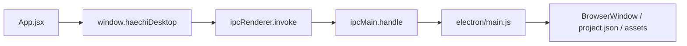
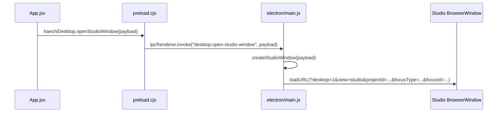
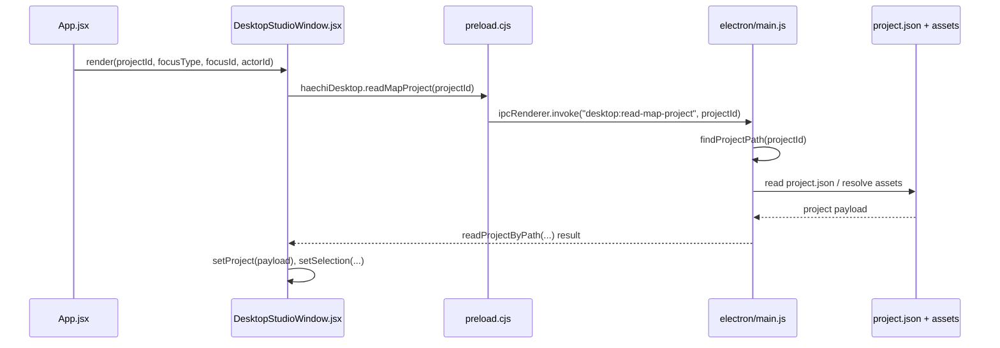
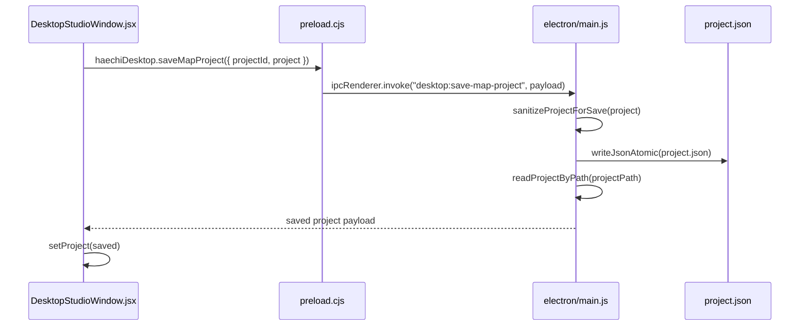
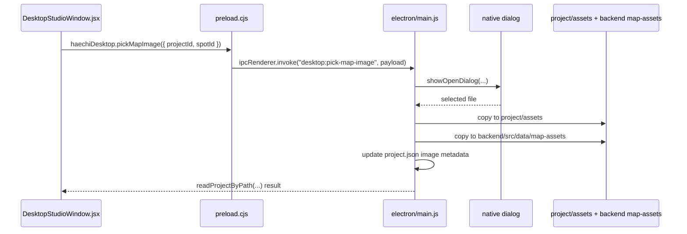

# Spot Studio -> Electron IPC API 흐름 분석

## 목적

이 문서는 현재 구현 기준으로 `Spot Studio`가 어떤 경로로 `Electron IPC API`를 호출하는지, 그리고 그 호출이 실제 파일 시스템 및 백엔드 자산 경로와 어떻게 연결되는지를 설명한다.

핵심 결론은 다음과 같다.

- `Spot Studio`는 별도 `BrowserWindow`에서 동작하는 React renderer이다.
- 편집 작업 대부분은 renderer 내부 state에서 처리된다.
- IPC는 주로 창 열기, 프로젝트 읽기, 프로젝트 저장, 이미지 가져오기, 윈도우 제어 시점에만 사용된다.
- 현재 맵 라이브러리 탐색과 CRUD 일부는 backend REST API를 사용하고, Studio 저장은 Electron 메인 프로세스의 로컬 파일 저장을 사용한다.

## 관련 파일

- `frontend/src/App.jsx`
- `frontend/src/features/desktop-studio/DesktopStudioWindow.jsx`
- `frontend/src/features/desktop-studio/desktopStudioProjectController.js`
- `frontend/src/features/spot-studio/spotEditorModel.js`
- `frontend/src/features/spot-studio/components/MapCanvas.jsx`
- `frontend/src/features/spot-studio/components/SpotStudioToolbar.jsx`
- `frontend/src/features/spot-studio/components/SpotStudioInspectorPanel.jsx`
- `electron/preload.cjs`
- `electron/main.js`
- `backend/src/server.js`
- `backend/src/data/maps.json`

## 레이어 구조

현재 구조는 크게 4개 레이어로 나뉜다.

1. Renderer UI 레이어
   `App.jsx`, `DesktopStudioWindow.jsx`, `MapCanvas.jsx`, `SpotStudioToolbar.jsx`, `SpotStudioInspectorPanel.jsx`

2. Renderer 상태 제어 레이어
   `desktopStudioProjectController.js`, `spotEditorModel.js`

3. Electron bridge 레이어
   `preload.cjs`의 `window.haechiDesktop`

4. Electron main / 로컬 파일 레이어
   `electron/main.js`, 사용자 Documents 폴더의 `Haechi Map Library`, `backend/src/data/map-assets`

## 전체 흐름 요약



실제 Spot Studio의 흐름은 두 단계로 나뉜다.

1. 메인 앱에서 Spot Studio 창을 연다.
2. 열린 Spot Studio 창이 다시 IPC를 통해 프로젝트를 읽고 저장한다.

## 1. App에서 Spot Studio 창을 여는 흐름

메인 진입점은 `frontend/src/App.jsx`이다.

- 데스크톱 환경이면 `window.haechiDesktop`가 존재한다.
- 사용자가 Explorer, Context Menu, 버튼 UI에서 `Spot 스튜디오`, `Deck 스튜디오`, `Domain 스튜디오`를 누르면 `desktopBridge.openStudioWindow(...)`가 호출된다.
- 이때 payload에는 `projectId`, `focusType`, `focusId`, `actorId`가 담긴다.

대표적인 호출 패턴은 다음과 같다.

- Spot 열기: `projectId + focusType: "spot" + focusId: spot.id`
- Deck 열기: `projectId + focusType: "deck"`
- Domain 열기: `projectId + focusType: "domain" + focusId: domain.id`

시퀀스는 아래와 같다.



### openStudioWindow 이후 메인 프로세스가 하는 일

`electron/main.js`의 `createStudioWindow()`는 다음을 수행한다.

- `windowKey = projectId:focusType:focusId` 형태로 중복 창을 방지한다.
- `BrowserWindow`를 새로 만들고 `preload.cjs`를 연결한다.
- `contextIsolation: true`, `nodeIntegration: false`로 renderer 권한을 제한한다.
- 쿼리스트링에 `desktop=1`, `view=studio`, `projectId`, `focusType`, `focusId`, `actorId`를 실어 renderer를 연다.

즉, Spot Studio는 별도의 라우터를 쓰는 것이 아니라 같은 프론트엔드 앱을 다른 쿼리 파라미터로 띄우는 방식이다.

## 2. Studio 창 부팅과 프로젝트 로드 흐름

Studio 창이 열리면 같은 `App.jsx`가 다시 실행된다. 여기서 `view=studio`가 감지되면 메인 대시보드 대신 `DesktopStudioWindow`를 렌더링한다.



### DesktopStudioWindow 초기화 포인트

`DesktopStudioWindow.jsx`에서 첫 `useEffect`는 다음 순서로 동작한다.

1. `desktopBridge.readMapProject(projectId)` 호출
2. 응답 payload를 `setProject(payload)`로 저장
3. 기본 selection을 `{ type: "deck", id: payload.deckId }`로 설정
4. 이후 `focusType`, `focusId`, `isSpotStudio`를 다시 해석해서 Spot selection 여부를 조정

여기서 `isSpotStudio`의 기준은 단순하다.

- `focusType === "spot"`이면 Spot Studio 모드
- 나머지는 Deck/Domain 계열 모드

즉 현재 구현에서 Domain Studio는 완전한 별도 에디터라기보다, 비 Spot 모드의 변형으로 취급된다.

## 3. Electron main이 프로젝트를 읽는 방식

`desktop:read-map-project`는 `electron/main.js`에서 처리된다.

### 3-1. projectId 해석

`findProjectPath(projectId)`는 두 형태를 모두 허용한다.

- 로컬 라이브러리용 `domainId::folderName`
- backend 쪽 deck 식별자

이 로직 덕분에 renderer는 backend가 넘긴 `deck.id`를 그대로 사용해도 Studio 창을 열 수 있다.

### 3-2. 실제 저장 위치

로컬 라이브러리 루트는 다음 경로다.

```text
{Documents}/Haechi Map Library/
  {DomainName}/
    {DeckFolder}/
      project.json
      assets/
```

이 경로는 `app.getPath("documents")`를 기준으로 만들어진다.

### 3-3. readProjectByPath가 하는 일

`readProjectByPath(projectPath)`는 단순히 `project.json`만 읽는 함수가 아니다.

- `project.json`을 읽는다.
- Deck 이미지 descriptor를 복원한다.
- Spot별 이미지 descriptor도 복원한다.
- `src`, `serverSrc`, `previewSrc`를 조합해 renderer가 바로 쓸 수 있는 형태로 payload를 만든다.

즉 renderer가 받는 project 객체는 저장 포맷과 완전히 같지 않다. 읽기 시점에 화면용 필드가 추가된다.

## 4. Spot Studio 내부 편집은 어떻게 흘러가는가

Spot Studio 내부 편집의 핵심은 `DesktopStudioWindow.jsx`가 상위 컨트롤러 역할을 하고, 실제 UI 컴포넌트는 callback만 올린다는 점이다.

흐름은 다음과 같다.

```mermaid
flowchart LR
  A[SpotStudioToolbar / MapCanvas / Inspector] --> B[DesktopStudioWindow handlers]
  B --> C[createDesktopStudioProjectController]
  C --> D[updateProjectSpot / updateProjectSpotEditor]
  D --> E[setProject(nextProject)]
```

### 관련 역할 분리

- `SpotStudioToolbar`
  Spot 선택, 이미지 가져오기, 원점 모드, 간선 모드 전환

- `MapCanvas`
  캔버스 클릭, 웨이포인트 이동, 간선 생성, 구역 리사이즈 같은 상호작용 발생

- `SpotStudioInspectorPanel`
  calibration 값 수정

- `DesktopStudioWindow`
  모든 이벤트 핸들러의 집결지

- `desktopStudioProjectController.js`
  `updateSpotEditor`, `updateSpot`를 제공하고 `setProject`를 호출

- `spotEditorModel.js`
  editor 상태 normalize 및 immutable update 수행

### 중요한 점

Spot Studio에서 일어나는 대부분의 작업은 즉시 IPC를 호출하지 않는다.

- 원점 선택
- resolution, rotation, grid 값 수정
- waypoint, edge, area 편집
- hierarchy 선택/삭제

이런 작업은 모두 React state 안에서 `project`를 갱신하는 방식으로 누적된다. 실제 파일 저장은 사용자가 상단 `저장` 버튼을 눌렀을 때 한 번만 일어난다.

## 5. 저장 흐름

저장 버튼은 `DesktopStudioWindow.jsx`의 `handleSave()`에 연결되어 있다.



### saveMapProject의 실제 동작

`saveMapProject()`는 다음 순서로 처리된다.

1. `findProjectPath(projectId)`로 실제 폴더 찾기
2. `sanitizeProjectForSave(project)` 호출
3. `writeJsonAtomic()`으로 `project.json` 저장
4. 저장 직후 `readProjectByPath()`로 다시 읽어 renderer에 반환

### sanitizeProjectForSave가 중요한 이유

renderer의 project 객체에는 화면 표시용 필드가 포함된다.

- `image.src`
- `image.previewSrc`
- spot image의 `src`, `previewSrc`

이 값들은 저장 전에 제거된다. 즉 저장 포맷은 "순수 데이터", 렌더링 포맷은 "UI용 파생 데이터 포함"으로 분리되어 있다.

## 6. 이미지 가져오기 흐름

Spot Studio에서 맵 이미지를 바꾸는 흐름은 저장보다 조금 더 복합적이다.



### pickMapImage의 특징

- 파일 선택은 native dialog를 사용한다.
- 선택된 파일은 프로젝트 폴더의 `assets`로 복사된다.
- 동시에 backend의 `map-assets` 디렉터리에도 복사된다.
- `nativeImage.createFromPath()`로 실제 이미지 크기를 계산한다.
- Spot 모드면 `spot.image`가 갱신되고, 그렇지 않으면 `project.image`가 갱신된다.

이 구조 덕분에 renderer는 `/map-assets/...` URL과 base64 preview를 모두 활용할 수 있다.

## 7. preload 브리지의 역할

`electron/preload.cjs`는 `contextBridge.exposeInMainWorld("haechiDesktop", ...)`로 안전한 API 표면을 renderer에 노출한다.

현재 Spot Studio와 직접적으로 관련 있는 메서드는 다음과 같다.

| preload API | IPC 채널 | 용도 |
| --- | --- | --- |
| `openStudioWindow(payload)` | `desktop:open-studio-window` | Studio 전용 창 열기 |
| `readMapProject(projectId)` | `desktop:read-map-project` | 로컬 프로젝트 읽기 |
| `saveMapProject(payload)` | `desktop:save-map-project` | 로컬 프로젝트 저장 |
| `pickMapImage(payload)` | `desktop:pick-map-image` | Deck/Spot 이미지 가져오기 |
| `minimizeWindow()` | `desktop:window-minimize` | 창 최소화 |
| `toggleMaximizeWindow()` | `desktop:window-toggle-maximize` | 창 최대화/복원 |
| `isWindowMaximized()` | `desktop:window-is-maximized` | 현재 최대화 상태 조회 |
| `closeWindow()` | `desktop:window-close` | 창 닫기 |

추가로 아래 API도 preload와 main에는 정의되어 있다.

- `getMapLibrary`
- `createMapProject`
- `renameDomain`
- `renameMapProject`
- `deleteMapProject`
- `renameProjectSpot`
- `deleteProjectSpot`

하지만 현재 renderer의 주 경로에서는 이 IPC 대신 backend REST API(`/api/maps/...`)를 쓰는 부분이 더 많다.

## 8. backend와의 관계

현재 구현은 Electron IPC와 backend REST가 완전히 분리된 단일 경로가 아니라, 서로 다른 책임을 나눠 가진 혼합 구조다.

### backend가 담당하는 것

- `/api/maps/library`
- `/api/maps/studio`
- `/api/maps/monitor`
- `/api/maps/decks`
- `/api/maps/spots`
- `/map-assets` 정적 서빙

### electron main이 담당하는 것

- Studio 창 생성
- 로컬 `Haechi Map Library` 시드 생성
- `project.json` 읽기/저장
- 이미지 파일 복사

즉 메인 앱의 라이브러리 브라우저는 REST 기반이고, Studio 창의 편집 저장은 IPC 기반이다.

## 9. 현재 구조에서 꼭 문서화해야 할 해석 포인트

### 9-1. Spot Studio는 "실시간 IPC 편집기"가 아니다

Spot Studio는 편집 이벤트마다 IPC를 보내지 않는다. 편집은 renderer state에 쌓이고 저장 시점에만 IPC를 탄다.

이 말은 곧 다음과 같다.

- 편집 반응성은 좋다.
- 저장 전까지는 메모리 상태다.
- 다른 창이나 backend와 실시간 동기화되지는 않는다.

### 9-2. Domain Studio는 아직 전용 구현이 아니다

`focusType: "domain"`은 창 제목과 진입 파라미터에는 반영된다. 하지만 `DesktopStudioWindow.jsx` 내부의 실제 분기 핵심은 `focusType === "spot"` 여부다.

따라서 현재 Domain Studio는 "비 Spot 모드의 Studio 창"에 가깝고, 별도 Domain 편집 모델이 구현된 상태는 아니다.

### 9-3. actorId는 전달되지만 실제 저장 로직에 쓰이지 않는다

`openStudioWindow()`는 `actorId`를 URL에 실어 보낸다. 그러나 현재 `DesktopStudioWindow.jsx`와 `electron/main.js`의 저장 로직에서는 이 값이 권한 검증이나 감사 로그에 사용되지 않는다.

즉 현재 actorId는 "확장 여지를 남긴 파라미터"에 가깝다.

### 9-4. 로컬 저장소와 backend draft가 이원화되어 있다

가장 중요한 포인트다.

- backend 메인 앱은 `backend/src/data/maps.json`을 중심으로 움직인다.
- Electron Studio는 사용자 Documents 아래의 `Haechi Map Library`를 중심으로 움직인다.
- `ensureSeedLibrary()`는 backend draft/published를 로컬 라이브러리에 다시 동기화한다.

이 구조는 현재 "Studio 로컬 편집 결과가 backend의 canonical draft로 자동 반영되지 않는다"는 뜻이다.

즉 다음 현상이 발생할 수 있다.

- Studio에서 `project.json`을 저장했다.
- 이후 라이브러리 재시드가 일어났다.
- backend `maps.json` 내용이 다시 로컬 프로젝트를 덮어쓸 수 있다.

특히 `ensureSeedLibrary()`는 기존 로컬 `project.json`을 읽은 뒤에도 대부분의 구조를 backend source 기준으로 다시 합성한다. 현재 코드상 명시적으로 보존되는 값은 이미지의 `fileName` 정도뿐이다.

이 부분은 운영 관점에서 반드시 "현재 구조의 제약"으로 문서화해야 한다.

### 9-5. IPC API 표면과 실제 사용 경로가 완전히 일치하지 않는다

preload와 main에는 라이브러리 CRUD용 IPC가 준비되어 있지만, 실제 App UI는 다수의 작업을 backend REST로 수행한다.

따라서 현재 문서에서는 다음처럼 표현하는 것이 맞다.

- "정의된 IPC API"
- "현재 Spot Studio가 실제 사용하는 IPC API"

둘을 구분하지 않으면 구조를 오해하기 쉽다.

## 10. 문서용 한 문단 요약

현재 HAECHI의 Spot Studio는 React 기반 `DesktopStudioWindow`가 중심이 되는 로컬 편집기이며, `window.haechiDesktop` 브리지를 통해 Electron IPC와 연결된다. 메인 앱에서 사용자가 Spot/Deck/Domain 스튜디오를 열면 renderer는 `desktop:open-studio-window`를 호출하고, Electron 메인 프로세스는 전용 `BrowserWindow`를 생성해 `view=studio` 쿼리로 같은 프론트엔드를 다시 로드한다. 열린 Studio 창은 `desktop:read-map-project`로 로컬 `project.json`과 asset 정보를 읽고, 캔버스 편집과 calibration 수정은 모두 renderer state 안에서 처리한 뒤, 사용자가 저장 버튼을 눌렀을 때만 `desktop:save-map-project`를 통해 파일 시스템에 반영한다. 이미지 변경은 `desktop:pick-map-image`를 통해 native dialog와 파일 복사 로직을 거치며, backend의 `/map-assets` 정적 경로와도 연결된다. 다만 현재 구조는 backend의 `maps.json` 기반 draft와 Electron 로컬 라이브러리가 이원화되어 있어, Spot Studio 저장 결과가 backend canonical 데이터와 자동 동기화되지 않는다는 제약을 가진다.
