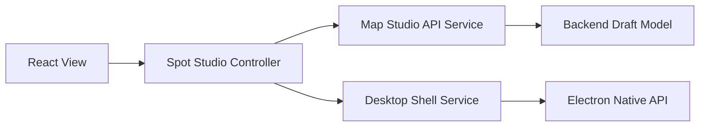

# Spot Studio에 공통 MVC 룰 적용 방안

## 목적

이 문서는 `rules/common_architecture_mvc_rules.md`에서 정의한 공통 룰을 `Spot Studio`에 실제로 어떻게 적용할지 정리한다.

## 현재 Spot Studio 상태 요약

현재 Spot Studio는 다음 특징을 가진다.

- Studio 창 열기: Electron IPC
- 프로젝트 로드/저장: Electron IPC
- 라이브러리 탐색, Domain/Deck/Spot CRUD: backend REST
- 편집 중 상태: renderer local state
- 이미지 선택: Electron IPC

즉 한 feature 안에서 transport와 canonical source가 섞여 있다.

## 현재 문제

### 1. 저장 원본이 둘이다

- backend의 `maps.json`
- Electron local `project.json`

이 상태에서는 Spot Studio에서 저장한 값과 publish에 쓰는 draft가 다를 수 있다.

### 2. 같은 도메인에 두 개의 CRUD 계층이 있다

- REST: `/api/maps/...`
- IPC: `desktop:save-map-project`, `desktop:rename-project-spot` 등

이 구조는 유지보수 시 어느 경로가 진짜인지 계속 헷갈리게 만든다.

### 3. 모델 이름이 도메인과 어긋난다

Spot Studio 내부에서 `project`라는 이름이 실제로는 `deck`를 의미하는 경우가 많다.

예:

- `projectId`가 사실상 `deckId`
- `project.spots`는 실질적으로 `deck.spots`

### 4. controller와 service 경계가 없다

`DesktopStudioWindow`가 현재 너무 많은 역할을 가진다.

- 로드
- 저장
- 이미지 선택
- selection 제어
- waypoint/edge/area 편집
- 메시지 처리

즉 View + Controller + 일부 Service 역할이 한 파일에 몰려 있다.

## Spot Studio 목표 구조

Spot Studio는 아래 구조로 정리하는 것이 맞다.

```text
Spot Studio
  View
    - DesktopStudioWindow
    - MapCanvas
    - SpotStudioToolbar
    - SpotStudioInspectorPanel
    - SpotHierarchySidebar

  Controller
    - spotStudioController
    - spotStudioSelectionController
    - spotStudioEdgeController

  Service
    - mapStudioApi
    - desktopShellService

  Model
    - mapDocument model
    - deck selectors
    - spot editor model
```

## 목표 책임 분리

### View

컴포넌트는 다음만 한다.

- state 표시
- 이벤트 전달
- controller 결과 반영

### Controller

controller는 다음을 담당한다.

- 현재 deck/spot selection 계산
- hold edge chain 처리
- save payload 구성
- 화면 메시지/오류 정리
- service 호출 orchestration

### Service

service는 다음만 담당한다.

- backend API 호출
- Electron native 기능 호출
- DTO 변환

### Model

model은 다음만 담당한다.

- normalize
- selector
- immutable patch helper
- dto <-> ui model mapper

## Spot Studio에서 transport를 정리하는 방식

### backend API로 통일할 것

- deck load
- deck save
- spot rename/update
- deck rename/update
- spot/deck create/delete
- publish 반영 대상 draft 저장

### Electron IPC로만 남길 것

- Studio 창 열기
- 창 최소화/최대화/닫기
- 이미지 파일 선택 dialog

즉 Spot Studio의 기준 흐름은 아래처럼 바뀌어야 한다.



## Spot Studio canonical model

Spot Studio는 `project`가 아니라 `deck`를 편집하는 feature로 정의한다.

권장 상태명:

- `deckDraft`
- `selectedSpotId`
- `selectedEdgeId`
- `selectedWaypointIds`
- `spotEditorState`

정리 대상 이름:

- `project` -> `deckDraft`
- `projectId` -> `deckId`
- `effectiveSpotEditor` 유지 가능
- `desktopBridge.saveMapProject` 제거 예정

## Spot Studio 리팩터링 단계

### 단계 1. 이름 정리

먼저 의미가 어긋난 이름을 바꾼다.

- `project` -> `deckDraft`
- `projectId` -> `deckId`
- `readMapProject` -> `loadDeckDraft`
- `saveMapProject` -> `saveDeckDraft`

이 단계는 동작 변경 없이도 먼저 진행할 수 있다.

### 단계 2. service 계층 도입

권장 파일:

```text
frontend/src/features/spot-studio/services/mapStudioApi.js
frontend/src/features/spot-studio/services/desktopShellService.js
frontend/src/features/spot-studio/controllers/spotStudioController.js
```

예상 책임:

- `mapStudioApi`
  backend REST 호출 전담

- `desktopShellService`
  `openStudioWindow`, `pickImageFile`, `window controls`

- `spotStudioController`
  View와 service 사이 orchestration

### 단계 3. 저장 경로 통일

현재 `DesktopStudioWindow`의 저장 버튼은 Electron IPC로 local `project.json`에 저장한다.

목표는 이것을 backend draft 저장으로 교체하는 것이다.

대상 변경:

- 현재: `desktopBridge.saveMapProject({ projectId, project })`
- 목표: `mapStudioApi.saveDeckDraft(deckId, patch)`

여기서 `patch`는 전체 deck 또는 변경 diff 둘 중 하나로 정한다. 초기 리팩터링에서는 전체 deck 저장이 더 안전하다.

## 저장 방식 권장안

### 1차 권장

전체 deck 저장

장점:

- 구현 단순
- Spot editor의 복합 상태를 안전하게 저장 가능
- edge/waypoint/area 변경을 한 번에 처리 가능

단점:

- payload가 커질 수 있음

### 2차 권장

부분 patch 저장

장점:

- 네트워크 효율

단점:

- patch 규칙이 복잡해짐
- selection 기반 편집 로직과 충돌 가능

따라서 Spot Studio는 먼저 전체 deck 저장으로 옮긴 뒤, 안정화 후 patch 기반으로 줄이는 것이 낫다.

## 이미지 처리 방식

이미지 선택은 Electron이 계속 담당해도 된다. 다만 canonical 저장은 backend로 보내야 한다.

권장 흐름:

1. `desktopShellService.pickImageFile()`로 로컬 파일 선택
2. 선택한 파일을 backend upload API로 전달
3. backend가 asset 경로와 메타데이터를 canonical model에 저장
4. Spot Studio는 backend 응답으로 새 draft를 다시 받음

즉 Electron은 "파일 선택"만 하고, "맵 모델 갱신"은 backend가 해야 한다.

## Spot Studio controller 분리안

### `spotStudioController`

담당:

- load deck
- save deck
- message/error state
- toolbar command 처리

### `spotStudioSelectionController`

담당:

- 현재 선택된 spot/edge/area 계산
- hierarchy selection
- focus mode 처리

### `spotStudioEdgeController`

담당:

- single edge mode
- hold chain mode
- edge dedupe
- edge direction rule

이번에 수정한 `HOLD` 체인 버그도 이 controller 분리가 되면 더 명확하게 관리할 수 있다.

## Spot Studio 적용 순서

### 1. 안전 단계

- 현재 버그 수정 유지
- service/controller 파일 추가
- naming 정리

### 2. 저장 경로 전환 단계

- load/save를 backend API로 교체
- Electron local `project.json` 저장 사용 중단
- backend draft와 Spot Studio를 직접 연결

### 3. 정리 단계

- `electron/main.js`의 맵 CRUD IPC 제거
- `preload.cjs`의 맵 CRUD bridge 제거
- local library seed/mirror 로직 제거

### 4. 구조 고도화 단계

- shared model/schema 도입
- controller 단위 테스트 추가
- domain/deck/spot 창 오픈 규약 정리

## 완료 조건

Spot Studio에 공통 MVC 룰이 적용되었다고 볼 수 있는 조건은 아래와 같다.

- Spot Studio가 backend draft를 직접 읽고 저장한다.
- Spot Studio는 로컬 `project.json`을 canonical data로 사용하지 않는다.
- `DesktopStudioWindow`는 View 중심 파일로 축소된다.
- edge/waypoint/area 편집 규칙이 controller 계층으로 분리된다.
- Electron은 window/dialog 기능만 제공한다.

## 권장 첫 구현 묶음

가장 현실적인 첫 배치는 아래 순서다.

1. `DesktopStudioWindow`의 `project` 명칭을 `deckDraft`로 교체
2. `spotStudioController`와 `mapStudioApi` 추가
3. Spot Studio load/save를 backend API로 이관
4. image picker만 Electron bridge 유지
5. local library mirror 제거

이 순서로 가면 기능을 멈추지 않고도 점진적으로 구조를 정리할 수 있다.
